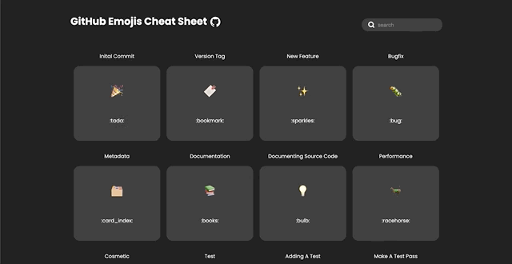

# Gitcomoji

A cheatsheet for commit messages with emojis.
https://gitcomoji.space

## Tech Stack

- Frontend
  - React.js
  - CCS Modules



### Contributing

- First take a look at the [website](https://gitcomoji.vercel.app/)
- Contributing is fairy simple pick a symbol/emoji [here](https://gist.github.com/rxaviers/7360908)
  - Make sure it makes sense for example you picked 🎨 which is :art:
  - Go to src/api/data.js add your it in this format:
    Title: explains what the symbol mean.
    Type: the actual emoji markup name.
    Symbol: the symbol/emoji of the markup.

```
  {
      title: 'improve format/structure',
      type: ':art:',
      symbol: '🎨',
  },
```

- After doing all of this just send a PR and we will check it.

## Authors

- **Jeremy Arrabe** - _Creator_ - [jeremeheh](https://github.com/jeremeheh)

## License

This project is licensed under the MIT License - see the [LICENSE.md](LICENSE.md) file for details

## Acknowledgments

- Hat tip to anyone whose code was used
